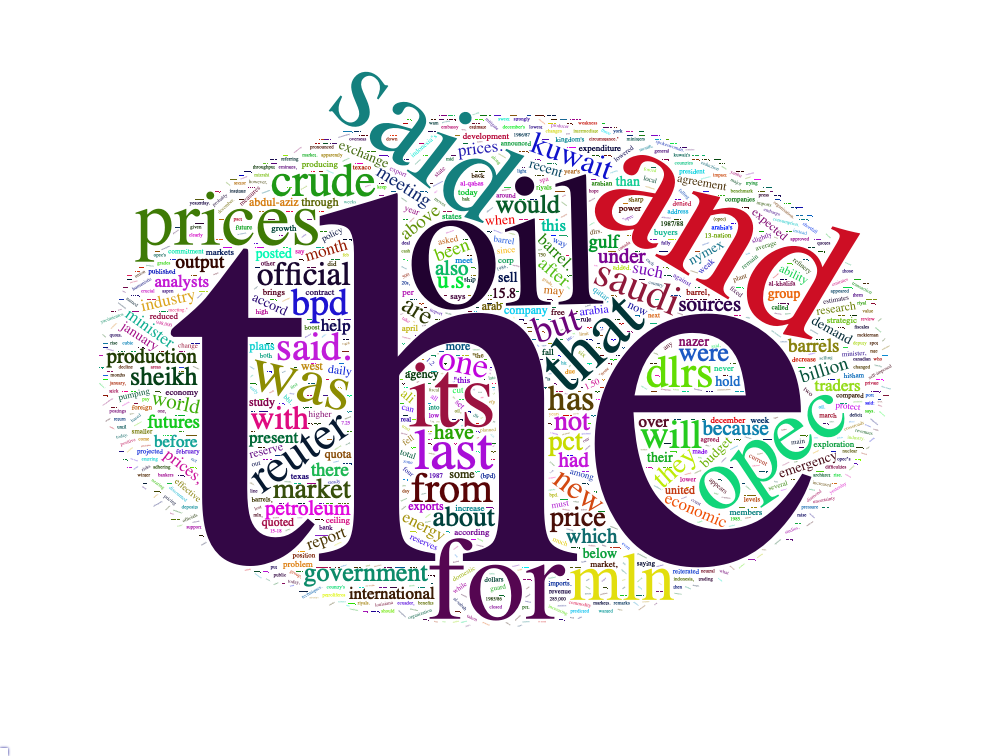
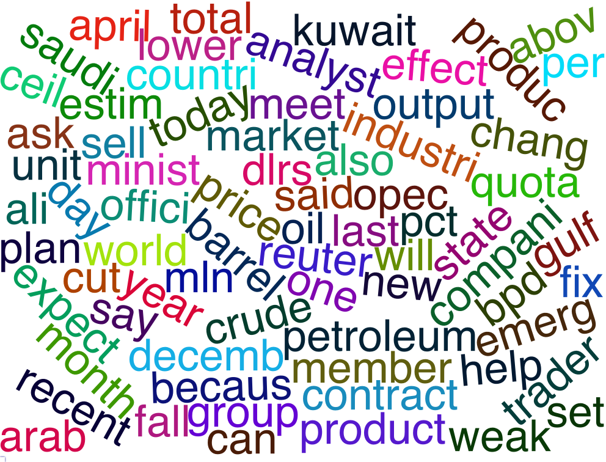

# Part 0 - Packages & Dataset
## 0.1 - Install packages
```{r}
# install.packages("tm")
# install.packages("StandardizeText")
# install.packages("SnowballC")
# install.packages("wordcloud")
# install.packages("wordcloud2")
# install.packages("tidytext")
# install.packages("webshot")
# library(webshot)
# install_phantomjs()
```
## 0.2 - Import packages
```{r}
library(NLP) # https://cran.r-project.org/web/packages/NLP/NLP.pdf
library(tm) # https://cran.r-project.org/web/packages/tm/tm.pdf
library(SnowballC)
library(RColorBrewer)
library(wordcloud) # https://cran.r-project.org/web/packages/wordcloud/wordcloud.pdf
library(wordcloud2)
library(tidytext)
library(webshot)
library(htmlwidgets)
```
## 0.3 - Load dataset
```{r}
data("crude")
corpus <- crude
```
# Part 1 - Preprocessing
## 1.1 - Tokenization
In order to tokenize a document, we can use the tokenizers provided by **tm** package.

**Description:** Tokenize a document or character vector.

**Usage:**

1. **Boost_tokenizer(x):** Uses the Boost (http://www.boost.org) Tokenizer (via Rcpp).
2. **MC_tokenizer(x):** Implements the functionality of the tokenizer in the MC toolkit (http://www.cs.utexas.edu/users/dml/software/mc/).
3. **scan_tokenizer(x):** Simulates scan(..., what = "character").

**Arguments:** x A character vector, or an object that can be coerced to character by as.character.

**Details:** The quality and correctness of a tokenization algorithm highly depends on the context and application scenario. Relevant factors are the language of the underlying text and the notions of whitespace (which can vary with the used encoding and the language) and punctuation marks. Consequently, for superior results you probably need a custom tokenization function.

**Returned value:** A character vector consisting of tokens obtained by tokenization of x.

**See Also:**

1. **getTokenizers** to list tokenizers provided by package **tm**.
2. **Regexp_Tokenizer** for tokenizers using regular expressions provided by package **NLP** (Docs: https://cran.r-project.org/web/packages/NLP/NLP.pdf).
3. **tokenize** for a simple regular expression based tokenizer provided by package **tau** (Docs: https://cran.r-project.org/web/packages/tau/tau.pdf).
4. **tokenizers** for a collection of tokenizers provided by package **tokenizers** (Docs: https://cran.r-project.org/web/packages/tokenizers/tokenizers.pdf).

```{r}
# Put in plainTextDocument the first item in the corpus
plainTextDocument <- corpus[[1]]
```

```{r, results = "hide"}
# Use boost tokenizer and print the output
boost_tokenized_document <- Boost_tokenizer(plainTextDocument)
boost_tokenized_document
```

<h4 style="color:red">EXERCISE: try MC_tokenizer and scan_tokenizer and print the results</h4>

```{r, results = "hide"}
# Use MC tokenizer and print the output

```

```{r, results = "hide"}
# Use SCAN tokenizer and print the output

```

```{r, results = "hide"}
# Declare custom regex-based tokenizer (it cuts on whitespaces)
split_space_tokenizer <- function(x)
    unlist(strsplit(as.character(x), "[[:space:]]+"))

# Use the custom tokenizer and print the output
split_space_tokenizeed_document <- split_space_tokenizer(plainTextDocument)
split_space_tokenizeed_document
```
## 1.2 - An insight of the corpus before processing
In order to have an insight of the most frequent words in the corpus, we can plot a *wordcloud* using **wordcloud** package.

**Description:**
Plot a word cloud.

**Usage:**
wordcloud(words, freq, scale=c(4,.5), min.freq=3, max.words=Inf, random.order=TRUE, random.color=FALSE, rot.per=.1, colors="black", ordered.colors=FALSE, use.r.layout=FALSE, fixed.asp=TRUE, ...)

**Arguments:**

- **words** the words
- **freq** their frequencies
- **scale** A vector of length 2 indicating the range of the size of the words.
- **min.freq** words with frequency below min.freq will not be plotted
- **max.words** Maximum number of words to be plotted. least frequent terms dropped
- **random.order** plot words in random order. If false, they will be plotted in decreasing frequency
- **random.color** choose colors randomly from the colors. If false, the color is chosen based on the frequency
- **rot.per** proportion words with 90 degree rotation
- **colors** color words from least to most frequent
- **ordered.colors** if true, then colors are assigned to words in order
- **use.r.layout** if false, then c++ code is used for collision detection, otherwise R is used
- **fixed.asp** if TRUE, the aspect ratio is fixed. Variable aspect ratio only supported if rot.per==0
- **...** Additional parameters to be passed to text (and strheight,strwidth).

**Details:** If **freq** is missing, then words can either be a character vector, or Corpus. If it is a vector and freq is missing, standard stop words will be removed prior to plotting.

```{r, results = "hide"}
# Create a TF document-term matrix before any processing (we'll go through this later...)
corpus_dtm <- DocumentTermMatrix(corpus)
# Plot original corpus wordcloud
corpus_matrix <- as.matrix(corpus_dtm)
v <- sort(colSums(corpus_matrix),decreasing = TRUE)
corpus_for_wc2<-data.frame(word=names(v),freq=v)
my_graph_1 <- wordcloud2(corpus_for_wc2, color="random-dark", size=3, shape="circle", backgroundColor="white")
saveWidget(my_graph_1, "tmp.html", selfcontained = F)
webshot("tmp.html", "my_graph_1.png", delay = 5)
```


## 1.3 - Pre-processing
We can apply pre-processing tranformation to the content of every item in the corpus using the function **tm_map** of the **tm** package.

**Description:** Interface to apply transformation functions (also denoted as mappings) to corpora.

**Usage:** tm_map(x, FUN, ..., lazy = FALSE)

**Arguments:**

- **x** -> a corpus.
- **FUN** -> a transformation function taking a text document (a character vector when x is a SimpleCorpus) as input and returning a text document (a character vector of the same length as the input vector for SimpleCorpus). The function content_transformer can be used to create a wrapper to get and set the content of text documents. (*You are PASSING a function as an argument, you are not CALLING it!*)
-  **...** -> arguments to FUN.
- **lazy** -> lazy mappings are mappings which are delayed until the content is accessed. It is useful for large corpora if only few documents will be accessed. In such a case it avoids the computationally expensive application of the mapping to all elements in the corpus.

**Returned value:**
A corpus with **FUN** applied to each document in **x**. In case of **lazy** mappings only internal flags
are set. Access of individual documents triggers the execution of the corresponding transformation
function.

The transformation functions provided by **tm** are:

1. **removeNumbers**
2. **removePunctuation**
3. **removeWords**
4. **stemDocument**
5. **stripWhitespace**
6. **content_transformer** -> to create custom transformations.

Read the official documentation for further details.

### 1.3.1 - Expand contractions in an English-language source

```{r}
fix.contractions <- function(doc) {
  # "won't" is a special case as it does not expand to "wo not"
  doc$content <- gsub("won't", "will not", doc$content)
  doc$content <- gsub("can't", "can not", doc$content)
  doc$content <- gsub("n't", " not", doc$content)
  doc$content <- gsub("'ll", " will", doc$content)
  doc$content <- gsub("'re", " are", doc$content)
  doc$content <- gsub("'ve", " have", doc$content)
  doc$content <- gsub("'m", " am", doc$content)
  doc$content <- gsub("'d", " would", doc$content)
  # 's could be 'is' or could be possessive: it has no expansion
  doc$content <- gsub("'s", "", doc$content)
  return(doc)
}
corpus_contraction_fixed <- tm_map(corpus, fix.contractions)
```

```{r}
# Print text BEFORE contraction fixes
corpus[[4]]$content
```

```{r}
# Print text AFTER contraction fixes
corpus_contraction_fixed[[4]]$content
```

### 1.3.2 - Replace diacritics ("González" -> "Gonzalez")
```{r}
fix.diacritics <- function(doc) {
  diacritics = list('Š'='S', 'š'='s', 'Ž'='Z', 'ž'='z', 'À'='A', 'Á'='A', 'Â'='A', 'Ã'='A', 'Ä'='A', 'Å'='A', 'Æ'='A', 'Ç'='C', 'È'='E', 'É'='E', 'Ê'='E', 'Ë'='E', 'Ì'='I', 'Í'='I', 'Î'='I', 'Ï'='I', 'Ñ'='N', 'Ò'='O', 'Ó'='O', 'Ô'='O', 'Õ'='O', 'Ö'='O', 'Ø'='O', 'Ù'='U', 'Ú'='U', 'Û'='U', 'Ü'='U', 'Ý'='Y', 'Þ'='B', 'ß'='Ss', 'à'='a', 'á'='a', 'â'='a', 'ã'='a', 'ä'='a', 'å'='a', 'æ'='a', 'ç'='c', 'è'='e', 'é'='e', 'ê'='e', 'ë'='e', 'ì'='i', 'í'='i', 'î'='i', 'ï'='i', 'ð'='o', 'ñ'='n', 'ò'='o', 'ó'='o', 'ô'='o', 'õ'='o', 'ö'='o', 'ø'='o', 'ù'='u', 'ú'='u', 'û'='u', 'ý'='y', 'ý'='y', 'þ'='b', 'ÿ'='y')

  doc$content <- chartr(paste(names(diacritics), collapse=''), paste(diacritics, collapse=''), doc$content)
  return(doc)
}
corpus_diacritics_fixed <- tm_map(corpus_contraction_fixed, fix.diacritics)
```


### 1.3.3 - Remove punctuation marks

First of all we remove punctuation marks.

```{r, results="hide"}
# Remove puntuation
corpus_no_punctuation <- tm_map(corpus_diacritics_fixed, removePunctuation)
```

```{r}
# Print text BEFORE punctuation marks removal
corpus[[1]]$content
```

```{r}
# Print text AFTER punctuation marks removal
corpus_no_punctuation[[1]]$content
```

### 1.3.4 - Normalization

Next we normalize the texts taking the following steps:

1. Switch to lower case;
2. Remove numbers;
3. Remove extra whitespaces.

```{r}
# To lower case
corpus_normalized <- tm_map(corpus_no_punctuation, content_transformer(tolower))
```

```{r}
# Print text AFTER to lower case
corpus_normalized[[1]]$content
```

<h4 style="color:red">EXERCISE: complete the normalization process</h4>

**HINT**: Pass `removeNumbers` as argument to `tm_map` function.

**HINT**: Pass `stripWhitespace` as argument to `tm_map` function.

```{r}
# Remove numbers

```

```{r}
# Remove unnecessary white spaces

```

### 1.3.5 - Stemming

After the normalization we reduce every word to its stem.
```{r}
# Stem words in the text of every item in the corpus using Porter’s stemming algorithm.
corpus_stemmed <- tm_map(corpus_normalized, stemDocument, language = "english")
```

```{r}
# Print text AFTER stemming
corpus_stemmed[[1]]$content
```

### 1.3.6 - Stop words removal

Than we remove the stop words.

```{r}
# Remove english stopwords from the text of every item in the corpus.
corpus_stopwords_removed <- tm_map(corpus_stemmed, removeWords, stopwords("english"))
corpus_preprocessed <- tm_map(corpus_stopwords_removed, stripWhitespace)
```

```{r}
# Print text AFTER stop-words removal
corpus_preprocessed[[1]]$content
```

<h4 style="color:red">EXERCISE: remove italian stopwords from the following piece of text, defining a custom stopwords list</h4>

**HINT**: Use `c(...)` to create the stopwords list.

**HINT**: Use `removeWords(text, stopwordList)` to remove the stopwords from the text..

```{r}
  # No, it's not a fake-news.
  text <- "Sicilia, arrestato il presidente dell'antiracket. Estorsioni a chi voleva accedere al fondo vittime."

```

# Part 2 - Representation

In order to represent the text of the items of the corpus, we can use **DocumentTermMatrix** function (or **TermDocumentMatrix** function) of **tm** package.

**Description:** Constructs or coerces to a term-document matrix or a document-term matrix.

**Usage:**

1. DocumentTermMatrix(x, control = list())
2. TermDocumentMatrix(x, control = list())

**Arguments:**

1. **x:** A corpus for the constructors and either a term-document matrix or a document-term matrix or a simple triplet matrix (package slam) or a term frequency vector for the coercing functions.

2. **control:** A named list of control options. There are local options which are evaluated for each document and global options which are evaluated once for the constructed matrix. (Read the docs for further details)

3. **weighting:** A weighting function capable of handling a DocumentTermMatrix or a TermDocumentMatrix. It defaults to **weightTf** for term frequency weighting. Available weighting functions shipped with the **tm** package are **weightTf**, **weightTfIdf**, **weightBin**, and **weightSMART**.

**Returned value:** An object of class **TermDocumentMatrix** or class **DocumentTermMatrix** (both inheriting from a simple triplet matrix in package **slam**) containing a sparse document-term matrix or term-document matrix. The attribute weighting contains the weighting applied to the matrix.

## 2.1 - Binary Vector Representation

```{r}
# Create a binary document-term matrix
corpus_dtm_bin <- DocumentTermMatrix(corpus_preprocessed, control = list(weighting = weightBin))
inspect(corpus_dtm_bin)
```

```{r}
# Plot binary document-term matrix wordcloud
corpus_matrix <- as.matrix(corpus_dtm_bin)
v <- sort(colSums(corpus_matrix),decreasing = TRUE)
corpus_for_wc2<-data.frame(word=names(v),freq=1)
my_graph_2 <- wordcloud2(corpus_for_wc2, fontFamily="Helvetica", fontWeight="100", color="random-dark", size=0.4, shape="circle", backgroundColor="white")
saveWidget(my_graph_2, "tmp.html", selfcontained = F)
webshot("tmp.html", "my_graph_2.png", delay = 5)
```
<!--  -->

## 2.2 - Count Vector / TF Representation
```{r}
# Create a TF document-term matrix
corpus_dtm_tf <- DocumentTermMatrix(corpus_preprocessed)
inspect(corpus_dtm_tf)
```

```{r}
# Plot TF document-term matrix wordcloud
corpus_matrix <- as.matrix(corpus_dtm_tf)
v <- sort(colSums(corpus_matrix),decreasing = TRUE)
corpus_for_wc2<-data.frame(word=names(v),freq=v)
my_graph_3 <- wordcloud2(corpus_for_wc2, fontFamily="Helvetica", fontWeight="100", color="random-dark", size=1.6, shape="circle", backgroundColor="white")
saveWidget(my_graph_3, "tmp.html", selfcontained = F)
webshot("tmp.html", "my_graph_3.png", delay = 5)
```
<!--  -->

## 2.3 - Bigram TF Representation
```{r}
# There is no Bigram Tokenizer in tm, so we create one
BigramTokenizer <- function(x) {
  unlist(lapply(ngrams(words(x), 2), paste, collapse = " "), use.names = FALSE)
}

corpus_bigram_tf <- DocumentTermMatrix(corpus_preprocessed, control = list(tokenize = BigramTokenizer))
inspect(corpus_bigram_tf)
```

```{r}
# Plot TF-IDF document-term matrix wordcloud
corpus_matrix <- as.matrix(corpus_bigram_tf)
v <- sort(colSums(corpus_matrix),decreasing = TRUE)
corpus_for_wc2 <- data.frame(word=names(v),freq=v)
bigram_tf_matrix_wc <- wordcloud2(corpus_for_wc2, fontFamily="Helvetica", fontWeight="100", color="random-dark", size=0.4, shape="circle", backgroundColor="white")
saveWidget(bigram_tf_matrix_wc, "tmp.html", selfcontained = F)
webshot("tmp.html", "bigram_tf_matrix_wc.png", delay = 5)
```
<!--  -->

## 2.4 - TF-IDF Representation

<h4 style="color:red">EXERCISE</h4>

**HINT**: Pass `control = list(weighting = function(x) weightTfIdf(x, normalize = FALSE))` as argument to `DocumentTermMatrix` function.

## 2.5 - Bigram TF-IDF Representation

<h4 style="color:red">EXERCISE</h4>

# Part 3 - Terms reduction
In order to remove sparse terms from a Document-Term Matrix we can use **removeSparseTerms** function of **tm** package.

**Description:** Remove sparse terms from a document-term matrix or term-document matrix.

**Usage:** removeSparseTerms(x, sparse)

**Arguments:**

- **x:** A DocumentTermMatrix or a TermDocumentMatrix.
- **sparse:** A numeric for the maximal allowed sparsity in the range from bigger zero to smaller one.

**Returned value:** A term-document matrix where those terms from **x** are removed which have at least a sparse percentage of empty (i.e., terms occurring 0 times in a document) elements. I.e., the resulting matrix contains only terms with a sparse factor of less than sparse.

## 3.1 - Terms reduction TF
```{r}
# Reduce dimension of DTM
corpus_dtm_tf_sparse_removed = removeSparseTerms(corpus_dtm_tf, 0.8)
inspect(corpus_dtm_tf_sparse_removed)
```

```{r}
# Plot removed-sparse-terms TF-IDF matrx wordcloud
corpus_matrix <- as.matrix(corpus_dtm_tf_sparse_removed)
v <- sort(colSums(corpus_matrix),decreasing = TRUE)
corpus_for_wc2<-data.frame(word=names(v),freq=v)
my_graph_5 <- wordcloud2(corpus_for_wc2, fontFamily="Helvetica", fontWeight="100", color="random-dark", size=1, shape="circle", backgroundColor="white")
saveWidget(my_graph_5, "tmp.html", selfcontained = F)
webshot("tmp.html", "my_graph_5.png", delay = 5)
```
<!--  -->

## 3.2 - Terms reduction Bigram TF

<h4 style="color:red">EXERCISE</h4>

## 3.3 - Terms reduction TF-IDF

<h4 style="color:red">EXERCISE</h4>

## 3.4 - Terms reduction Bigram TF-IDF

<h4 style="color:red">EXERCISE</h4>
